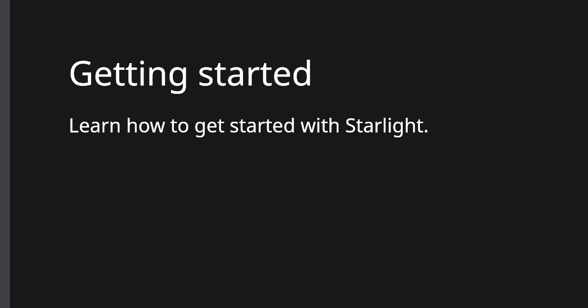

[Open Graph Data](https://ogp.me/) can be used by social media platforms like Facebook, X (formerly called Twitter), or Discord to add an image to your [Starlight](https://starlight.astro.build) page links when sharing them.
The image URL can be defined using the `og:image` and `twitter:image` meta tags.

Starlight does not yet provide a built-in mechanism to automatically generate these images using all the available [page data](https://starlight.astro.build/reference/overrides/#props) and add the corresponding meta tags to your pages.
This guide will show one possible way to do so using [`astro-og-canvas`](https://github.com/delucis/astro-og-canvas) which uses an Astro [endpoint](https://docs.astro.build/en/core-concepts/endpoints/) to generate the images.
The generated images can be customized using a large set of options including size, colors, fonts, logos, and more.

:::note[Related]
[Generate Open Graph images for Starlight using the Cloudinary Astro SDK](/notes/starlight-og-images-cloudinary-astro-sdk).
:::

## Prerequisites

You will need to have an existing Starlight website.

## Install `astro-og-canvas`

Start by installing the `astro-og-canvas` package:

import Pkg from '@components/Pkg.astro'

<Pkg pkg="astro-og-canvas" />

:::note
When using a [strict package manager](https://pnpm.io/pnpm-vs-npm#npms-flat-tree) like pnpm, you will also need to install `canvaskit-wasm` as a dependency using `pnpm add canvaskit-wasm` for example.
:::

## Create the image endpoint

`astro-og-canvas` provides an `OGImageRoute` helper that can be used to create an endpoint that will generate the various images for all documentation pages.

To do so, we need to do the following:

1. Get a list of all documentation entries from the `docs` content collection used by Starlight.
1. Map the entry array to an object with the [page ID](https://docs.astro.build/en/reference/api-reference/#id) as key and the [frontmatter data](https://starlight.astro.build/reference/frontmatter/) as value.
1. Pass down the object to the `OGImageRoute` helper.
1. Define a `param` option to match the name of the parameter used in the endpoint path.
1. Define a `getImageOptions` function called for each page to customize the generated image.

The following example will create the endpoint in a `src/pages/og/[...slug].ts` file:

```ts
// src/pages/og/[...slug].ts
import { getCollection } from 'astro:content'
import { OGImageRoute } from 'astro-og-canvas'

// Get all entries from the `docs` content collection.
const entries = await getCollection('docs')

// Map the entry array to an object with the page ID as key and the
// frontmatter data as value.
const pages = Object.fromEntries(entries.map(({ data, id }) => [id, { data }]))

export const { getStaticPaths, GET } = OGImageRoute({
  // Pass down the documentation pages.
  pages,
  // Define the name of the parameter used in the endpoint path, here `slug`
  // as the file is named `[...slug].ts`.
  param: 'slug',
  // Define a function called for each page to customize the generated image.
  getImageOptions: (_id, page: (typeof pages)[number]) => {
    return {
      // Use the page title and description as the image title and description.
      title: page.data.title,
      description: page.data.description,
      // Customize various colors and add a border.
      bgGradient: [[24, 24, 27]],
      border: { color: [63, 63, 70], width: 20 },
      padding: 120,
    }
  },
})
```

Visiting the endpoint will now generate an image for the page matching the `slug` parameter.
For example, visiting `/og/getting-started.png` would generate an image for the `getting-started` page.

## Override the `<Head/>` component

The next step is to [override](https://starlight.astro.build/guides/overriding-components/) the [`<Head/>`](https://starlight.astro.build/reference/overrides/#head-1) component used by Starlight to add the `og:image` and `twitter:image` meta tags containing the URL of the generated image for all documentation pages.

Create a custom Astro component to replace the existing `<Head/>` built-in component:

```astro
---
// src/components/Head.astro
import Default from '@astrojs/starlight/components/Head.astro'

// Get the URL of the generated image for the current page using its ID and
// append the `.png` file extension.
const ogImageUrl = new URL(
  `/og/${Astro.locals.starlightRoute.id || 'index'}.png`,
  Astro.site,
)
---

<!-- Render the default <Head/> component. -->
<Default><slot /></Default>

<!-- Render the <meta/> tags for the Open Graph images. -->
<meta property="og:image" content={ogImageUrl} />
<meta name="twitter:image" content={ogImageUrl} />
```

## Configure Starlight

The last step is to configure Starlight to use the custom `<Head/>` component instead of the built-in one and define the `site` Astro option.
The `site` option contains the deploy URL of your documentation website as Open Graph images require a valid URL having the `http` or `https` scheme.

The following example will configure Starlight in the `astro.config.mjs` file:

```js ins={7-8,10-13}
// astro.config.mjs
import { defineConfig } from 'astro/config'
import starlight from '@astrojs/starlight'

export default defineConfig({
  integrations: [
    // Define the deploy URL of the documentation website.
    site: 'https://example.com',
    starlight({
      components: {
        // Relative path to the custom component.
        Head: './src/components/Head.astro',
      },
      title: 'My Docs',
    }),
  ],
})
```

## Preview the generated images

Using [opengraph.xyz](https://www.opengraph.xyz/), you can preview the generated images for your documentation pages.

For example, given the following `src/content/docs/getting-started.md` file accessible at `https://example.com/getting-started`:

```md
---
# src/content/docs/getting-started.md
title: Getting started
description: Learn how to get started with Starlight.
---

My documentation page content.
```

The following meta tags will be added to the page:

```html
<head>
  <!-- ... -->
  <meta
    property="og:image"
    content="https://example.com/og/getting-started.png"
  />
  <meta
    name="twitter:image"
    content="https://example.com/og/getting-started.png"
  />
</head>
```

And the following Open Graph image will be generated:



Up to you to customize the image using the various [options](https://github.com/delucis/astro-og-canvas/tree/latest/packages/astro-og-canvas#image-options) provided by `astro-og-canvas`.

You can find the complete source code of this guide in this [StackBlitz example](https://stackblitz.com/edit/github-kwvza5?file=src%2Fpages%2Fog%2F%5B...slug%5D.ts).
